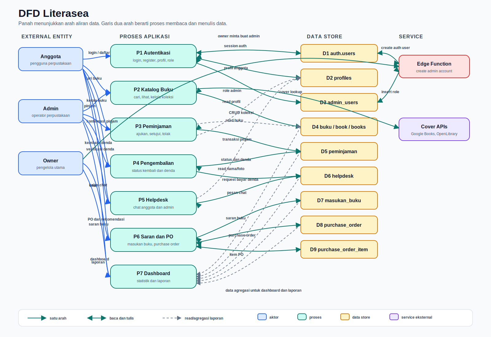
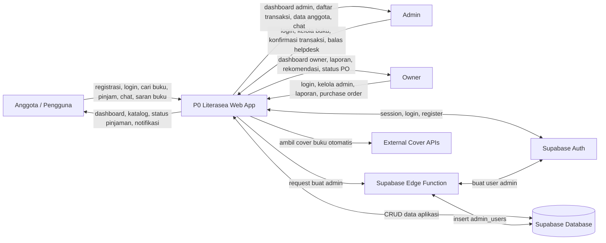

# Data Flow Diagram (DFD) - Literasea

Dokumen ini menggambarkan aliran data utama pada aplikasi Literasea setelah refactor. Diagram dibuat dalam format Mermaid agar mudah dirender di GitHub, VS Code, atau Markdown viewer yang mendukung Mermaid.

## DFD Level 0 - Context Diagram

Versi gambar visual dengan arah panah:

## DFD Level 1 - Proses Utama

```mermaid
flowchart TB
  Anggota["Anggota"]
  Admin["Admin"]
  Owner["Owner"]

  P1["P1 Autentikasi dan Profil"]
  P2["P2 Katalog dan Kelola Buku"]
  P3["P3 Peminjaman Buku"]
  P4["P4 Pengembalian dan Denda"]
  P5["P5 Helpdesk Chat"]
  P6["P6 Saran Buku dan Purchase Order"]
  P7["P7 Dashboard dan Laporan"]

  D1[("D1 auth.users")]
  D2[("D2 profiles")]
  D3[("D3 admin_users")]
  D4[("D4 buku / book / books")]
  D5[("D5 peminjaman")]
  D6[("D6 helpdesk_messages / helpdesk_chat")]
  D7[("D7 masukan_buku")]
  D8[("D8 purchase_order")]
  D9[("D9 purchase_order_item")]
  CoverAPI["External Cover APIs"]
  Edge["Edge Function create admin"]

  Anggota -->|"email, password, data registrasi"| P1
  Admin -->|"session admin"| P1
  Owner -->|"session owner"| P1
  P1 <-->|"session auth"| D1
  P1 <-->|"data profil anggota"| D2
  P1 <-->|"role admin / owner"| D3

  Anggota -->|"cari dan lihat buku"| P2
  Admin -->|"tambah, ubah, hapus buku"| P2
  P2 <-->|"data koleksi"| D4
  P2 -->|"lookup cover"| CoverAPI

  Anggota -->|"pengajuan pinjam"| P3
  Admin -->|"setujui / tolak pinjam"| P3
  P3 <-->|"data buku"| D4
  P3 <-->|"data transaksi pinjam"| D5
  P3 <-->|"identitas anggota"| D2

  Anggota -->|"lihat status dan ajukan bayar denda"| P4
  Admin -->|"proses pengembalian dan verifikasi denda"| P4
  P4 <-->|"status peminjaman, denda, status pembayaran"| D5
  P4 -->|"pesan pengajuan pembayaran"| D6

  Anggota -->|"kirim chat"| P5
  Admin -->|"balas chat"| P5
  P5 <-->|"thread dan pesan helpdesk"| D6
  P5 <-->|"foto dan nama anggota"| D2

  Anggota -->|"saran buku"| P6
  Admin -->|"ubah status saran"| P6
  Owner -->|"buat PO dari rekomendasi"| P6
  P6 <-->|"data saran buku"| D7
  P6 <-->|"header purchase order"| D8
  P6 <-->|"item purchase order"| D9

  Admin -->|"lihat dashboard"| P7
  Owner -->|"lihat laporan"| P7
  P7 <-->|"agregasi buku"| D4
  P7 <-->|"agregasi anggota"| D2
  P7 <-->|"agregasi transaksi dan denda"| D5
  P7 <-->|"agregasi helpdesk"| D6
  P7 <-->|"agregasi saran dan PO"| D7
  P7 <-->|"agregasi PO"| D8

  Owner -->|"data admin baru"| Edge
  Edge -->|"buat akun auth"| D1
  Edge -->|"simpan role admin"| D3
```

## Ringkasan Data Store

| Kode | Data Store | Isi Data |
| --- | --- | --- |
| D1 | `auth.users` | Akun autentikasi Supabase. |
| D2 | `profiles` | Profil anggota, ID anggota, kontak, foto profil. |
| D3 | `admin_users` | Data admin/owner dan role akses. |
| D4 | `buku`, `book`, `books` | Koleksi buku. `buku` adalah tabel utama, `book/books` didukung sebagai legacy source. |
| D5 | `peminjaman` | Pengajuan, status pinjam, pengembalian, denda. |
| D6 | `helpdesk_messages`, `helpdesk_chat` | Chat helpdesk modern dan legacy. |
| D7 | `masukan_buku` | Saran buku dari anggota dan status review admin. |
| D8 | `purchase_order` | Header purchase order owner. |
| D9 | `purchase_order_item` | Detail buku dalam purchase order. |

## Catatan

- DFD ini berfokus pada aliran data aplikasi web dan Supabase.
- `helpdesk_chat`, `book`, dan `books` dipertahankan sebagai legacy compatibility sesuai pemakaian kode.
- Pembuatan admin baru menggunakan Edge Function agar session owner di browser tidak terganti.
