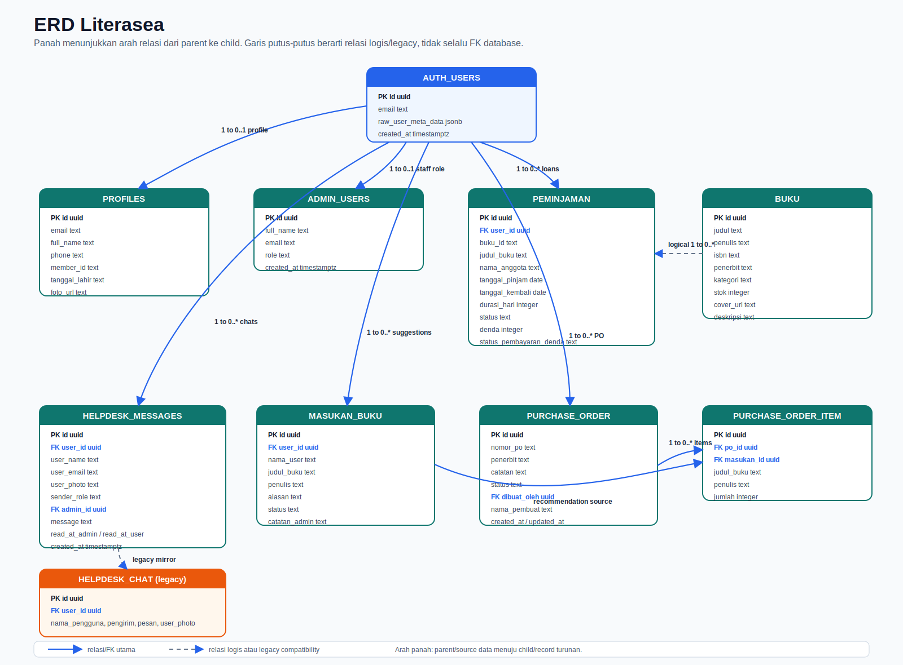
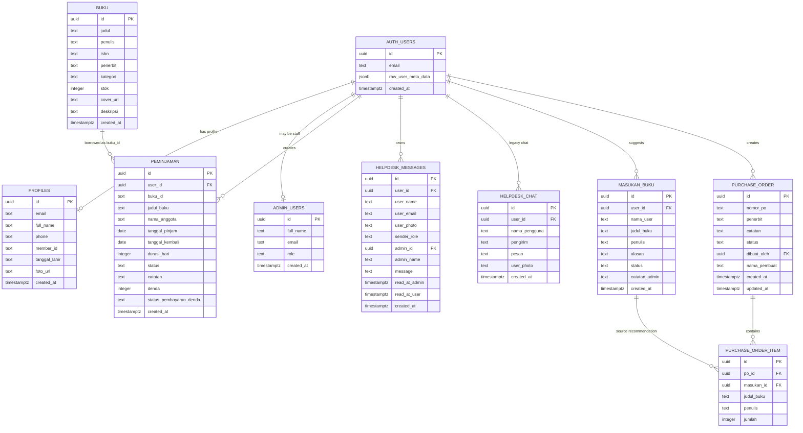

# Entity Relationship Diagram (ERD) - Literasea

Dokumen ini menggambarkan relasi data utama Literasea. Skema berasal dari file SQL di `sql/` dan dari field yang dipakai oleh frontend/Edge Function.

## ERD

Versi gambar visual dengan arah panah:

## Relasi Utama

| Relasi | Keterangan |
| --- | --- |
| `auth.users` -> `profiles` | Satu akun anggota memiliki satu profil. Profil dibuat/diupdate melalui trigger dan fallback frontend. |
| `auth.users` -> `admin_users` | Akun auth dapat memiliki role `admin` atau `owner`. |
| `auth.users` -> `peminjaman` | Anggota membuat banyak pengajuan peminjaman. |
| `buku` -> `peminjaman` | Buku dipinjam lewat `peminjaman.buku_id`. Field ini bertipe `text` untuk mendukung data legacy, jadi relasinya logis dan tidak selalu FK database. |
| `auth.users` -> `helpdesk_messages` | Anggota memiliki thread/pesan helpdesk. Admin juga dapat membalas via `admin_id`. |
| `auth.users` -> `masukan_buku` | Anggota dapat mengirim banyak saran buku. |
| `masukan_buku` -> `purchase_order_item` | Saran yang disetujui dapat menjadi item purchase order. |
| `purchase_order` -> `purchase_order_item` | Satu PO memiliki banyak item. |

## Catatan Skema

- Tabel `buku`, `peminjaman`, `helpdesk_messages`, dan penambahan kolom `profiles.foto_url` terdefinisi di folder `sql/`.
- Tabel `admin_users`, `masukan_buku`, `purchase_order`, `purchase_order_item`, dan `helpdesk_chat` digunakan oleh kode tetapi migration lengkapnya tidak ada di folder `sql/`; atributnya diturunkan dari pemakaian frontend dan Edge Function.
- Aplikasi juga mendukung tabel legacy `book` dan `books` sebagai sumber data buku, tetapi tabel utama yang distandardisasi adalah `buku`.
